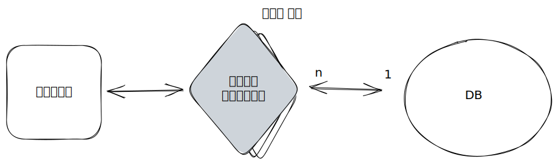

# MSA

수년간 웹 애플리케이션에서 가장 많은 관심을 받은 키워드는 MSA일 것이다. MSA는 현재도 지속적으로 아마존, 넷플릭스 등의 빅테크 기업들이 선도하고 있으며 아직도 많은 관심을 받고 있다. 이번 글은 MSA가 무엇인지에 대해 알아보려고 한다.&#x20;

먼저 MSA와 반대의 개념이지만 익숙한 모놀로식 아키텍처를 알아보고 MSA와 비교해보자.

## Monolotic

하나의 시스템이 서비스 전체 기능을 처리하도록 설계하는 것으로 과거부터 지금까지 많이 사용되는 아키텍처이다. 모놀로틱은 한 애플리케이션에서 다양한 비지니스 로직을 처리하며, 하나의 데이터 저장소를 사용한다.&#x20;

### 장점

1. **구조가 비교적 간단**하다. 한 애플리케이션이 한 데이터 저장소를 바라보며 모든 서비스 처리가 이곳에서 발생된다. 때문에 디버깅이나 로깅도 간단하다.&#x20;
2. **RDB의 Transaction** 기능을 쉽게 온전히 사용할 수 있다. 데이터 저장소가 하나이기 때문이다. **유닛, 통합 테스트**를 작성하기 쉽다.&#x20;

&#x20;\= 모놀로식 아키텍처는 간단한 구조이기 때문에 비교적 빠르고 쉽게 개발하고 운영할 수 있다.&#x20;

### 단점&#x20;

1. 서비스 기능이 많아질수록 애플리케이션이 **복잡해진다.**
2. 서비스가 커질수록 **빌드, 배포시간이 늘어난다**. 한 서비스만 수정 하더라도 애플리케이션 전체를 다시 빌드하고 배포해야하기 때문이다.&#x20;
3. **스케일 아웃의 한계**가 있다. 어떤 한 서비스만 성능이 더 필요해도 전체 애플리케이션 단의 성능을 높여야한다.&#x20;

\= 서비스가 규모가 커지면 확장에 한계가 있고 비효율적이다.&#x20;

### 모놀로식 아키텍처를 전환해야하는 상황

모놀로식 기반의 애플리케이션의 서비스가 점점 고도화되고 고객이 많아지면, 코드 품질과 성능을 높이려 노력을 해도 한계에 도달하는 수준이 있다. 아래의 상황을 겪게 된다면 아키텍처 전향을 고려해야 한다.&#x20;

* 로드밸런서 효과가 한계가 있을 때
* 데이터베이스의 스케일 업에 한계가 있을 때&#x20;
* 시스템이 너무 복잡해 기능 추가가 어려울 때
* 개발자는 늘었는데, 개발 속도는 오히려 늦어지거나 같을 때
* 수정 작업이 사이드 이펙트가 심할 때

## MSA&#x20;

MSA는 모놀로식과는 다르게 서비스를 각각 분리해 그것을 담당하는 애플리케이션을 두며, 서비스마다 독립적인 DB를 사용한다. 서비스들은 미리 정의된 인터페이스를 통해 서로 유기적으로 동작하며 전체 기능을 수행한다.

정해진 API를 통해 서비스 간의 통신해 서비스 간 느슨한 결합을 가질 수 있다. API 성능이 전반적인 애플리케이션 성능에 영향을 미치므로 가벼운 프로토콜을 사용해야 한다.

MSA는 특정 서비스를 구축하는 데 사용하는 언어나 저장소를 자율적으로 선택할 수 있다. 이를 Polyglot이라고 표현한다.&#x20;

### SOA

MSA는 서비스 지향 아키텍처(SOA)와 공통점이 많다. 서비스 지향 아키텍처도 서비스 기능 단위로 시스템을 만들고, 각 시스템끼리 인터페이스를 통해 서비스를 통합하는 아키텍처이기 때문이다.&#x20;

하지만 SOA는 개념적으로는 이상적이였지만 실제 현업에서 구체화는 실패했다. 왜냐하면 당시에는 클라우드 기술이 부족해 효율적으로 여러 서비스를 배포하고 운영하는 것은 현실적으로 힘들었을 것이다. 하지만 MSA는 충분히 성장한 클라우드 기술을 적극적으로 활용해 유연하고 빠른 서비스 배포와 운영이 가능하다.

또, SOA는 MSA와 달리 데이터 저장소를 독립적으로 두지 않았다. 따라서 데이터의 강한 결합으로 애플리케이션이 독립성을 가졌다고 보기 힘들었다.  하지만 MSA는 데이터베이스를 독립적으로 두고 서비스 간의 통신은 정해진 API를 이용한다. 그 결과 직접적으로 다른 서비스의 데이터베이스에 접근하지 않도록 해서 서비스의 독립성과 캡슐화를 높여 진정한 모듈화를 얻을 수 있게 했다.

이렇게 MSA는 SOA의 미흡한 점을 보완해 개념적으로만 그치지 않고 실제 아마존, 넷플릭스 등의 아주 복잡한 도메인과 많은 트래픽을 효율적으로 다루는 구체적인 아키텍처가 되었다.


모듈화 개념의 발전 흐름

1. 구조적(structed): 기능을 하향식 분해하는 설계&#x20;
2. 객체지향(oop): 객체 단위로 모듈화
3. CBD: 모듈화의 단위가 기능별로 재사용할 수 있는 더 큰 Component를 기반으로 개발
4. SOA: 컴퍼넌트를 모아 비지니스적으로 의미 있는 서비스 단위로 모듈화하는 아키텍처


## 장단점

### 장점

1. 간 서비스간 **독립성이 크다**. 즉, 느슨한 결합 때문에 다른 마이크로서비스 간의 간섭이 최소화 된다.&#x20;
2. 데이터베이스 확장에 유리하다.&#x20;

RDB는 기본적으로 스케일 아웃이 어렵다. 물론 샤딩이나 Replica를 통해 분산처리할 수 있지만 한계가 있다. No-SQL은 스케일 아웃에 비교적 더 유리하지만, 여러 노드에 저장된 데이터들을 다시 배치해야하는 리밸런싱이 필요하기 때문에 한계가 분명 존재하다.&#x20;

이 때 마이크로서비스는 독립된 데이터베이스를 갖고 있기 때문에 대용량 데이터베이스를 서비스 마다 분리하여 운영할 수 있다. 적은 범위의 독립된 데이터베이스에 샤딩이나 Replica를 적용하는 하는 것은 모놀로식의 하나의 큰 데이터베이스 보다 훨씬 적은 노력으로 성능을 얻을 수 있을 것이다.

3. 장애에 견고하다&#x20;

각 서비스가  독립되어 있으니 한 서비스가 장애가 나더라도 그 피해가 최소화 된다. 하지만 모놀로식이라면 DB 서버 장애가 나면 에러가 순식간에 전파되는 것처럼 하나의 장애가 전체 장애로 퍼질 가능성이 MSA보다 훨씬 크다.&#x20;

4. 배포 주기가 빠르다&#x20;

각 서비스마다 환경이 분리되어 있기 때문에 독립적으로 배포가 가능하다. 각각의 서비스 들은 분리된 작은 서비스이기 때문에 코드도 작고 test 또한 그 부분만 하면 되기 때문에 배포 주기가 빨라진다. 물론 CI/CD가 잘 구축되어야 한다.&#x20;

5. 전체적인 확장성이 높다.

성능이 더 필요한 서비스에만 스케일 업 or 스케일 아웃을 적용하고, 비용 절감이 필요한 곳은 IDC나 저렴한 클라우드 provider에서 운영하는 등 MSA는 각 서비스를 효율적으로 시스템 자원을 사용할 수 있다.&#x20;

\= 대규모 시스템을 효율적으로 개발하고 운영할 수 있다.

###

### 단점

1. **어렵다.**&#x20;

가장 큰 원인은 서비스들이 네트워크 상에 분산 되어 있기 때문이다. 이 상황에는 여러 상황을 고려해야한다.&#x20;

마이크로 서비스는 독립적인 데이터 저장소를 갖고 있기 때문에 트랜잭션을 사용할 수가 없다. 또, 네트워크는 언제든지 장애가 발생할 수 있고, 패킷이 누락 될 수 있으며, 네트워크가 지연 될 수도 있다. 이런 상황들을 고려해서 개발해야하기 때문에 어렵다.

2. **운영하기도 어렵다.**

앞서 말한 트랜잭션 이슈 때문에 데이터 일관성을 지키지 못한다. 따라서 다른 기술이나 패턴을 통해 일관성을 지켜야 한다. 또, 에러 발생 시 수많은 마이크로서비스에서 어떤 요청으로 인해 어디서 에러가 발생했는지 찾기가 힘들다.&#x20;

3. **설계하기도 어렵다.**

서비스를 어떻게 분리하고 어떤 방향으로 설계할 것인지도 고려해야 한다. 만약 너무 작게 서비스를 분리하면 유지보수나 너무 많은 통신으로 인해 성능이 낮아질 수 있다. 하나의 서비스가 너무 큰 책임을 맡으면 모놀로식 아키텍처처럼 유연하지 못하다. 이렇게 어떻게, 어느 정도 크기로 서비스를 나누어야 할지 기준을 만드는 과정이 힘들다.

4. **여러 가지 시스템이 추가적으로 필요하다.**

MSA는 애플리케이션 뿐 아니라 CI/CD, 모니터링, APM, Log 시스템 등 많은 추가 시스템을 운영해야지만 정상적으로 운영이 가능하다. 여러가지 시스템을 운영하고 유지보수하는 것도 쉽지 않다.

&#x20;

\= 어렵다. 어렵다. 어렵다.

## MSA 설계에 필요한 것들

### 문화&#x20;

1.

### 설계에 도움이 되는 것&#x20;

* 서비스 세분화 원칙: 서비스 지향 아키텍처의 핵심 원칙 중 하나로, 아래 네 가지 요소를 기반으로 나누도록 제안
  * 비지니스 기능: 비지니스 기능으로 서비스를 분리
  * 성능: 특정 서비스이 성능이 부족하다면 이 서비스를 분리하는 것을 고려
  * 메시지 크기: 성능과 비슷하게 API 메시지 크기가 너무 크면 성능 문제가 있으니 나누는 것을 고려
  * 트랜잭션: 트랜잭션을 기준으로 서비스를 나눔. 데이터를 기준으로 한 서비스 분리 방법&#x20;
* [DDD의 바운디드 컨텍스트:](ddd/ddd-start/bounded-context/) 도메인 모델과 확연히 구분되는 명시적인 경계를 통해 서비스를 분리&#x20;
* 단일 책임 원칙: 서비스가 하나의 책임만을 가져 응집도가 높오 결합도는 낮은 설계로 분리
* 가벼운 통신 프로토콜: 각 서비스간 통신은 필수인데, 통신은 네트워크를 통해서 한다. 따라서 네트워크 통신을 최적화 하기위해 가벼운 프로토콜을 사용해야한다.&#x20;
* 외부 공개 인터페이스: 외부에 공개한 인터페이스는 신중히 설계 해야한다. 다른 서비스가 인터페이스에 의존하고 있기 때문이다.&#x20;
* 마이크로서비스마다 독립된 데이터베이스:&#x20;

독립된 데이터베이스는 확장을 더 쉽게하고 각 서비스를 독립성 있게 해준다.

마이크로서비스가 하나의 같은 데이터베이스를 바라보는 것은 서비스의 독립성을 해친다. 처음엔 문제가 없어보여도 시간이 흘러 데이터가 쌓이면 서로 섞이고 경계가 무뎌져 결국엔 무늬만 마이크로서비스인 모놀로식이 될 것이다. 데이터베이스의 장애나 성능 저하가 모든 마이크로서비스에 영향을 미치게 된다.&#x20;

### 참고

스프링 부트로 개발하는 MSA 컴퍼넌트

도메인 주도 설계로 시작하는 마이크로서비스 개발&#x20;
