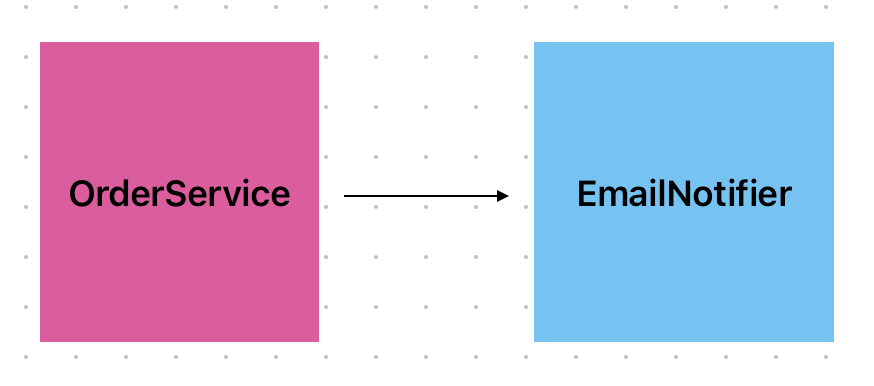

# 개요

## 객체지향 프로그래밍의 등장이유

과거 객체지향 프로그래밍 전에는 절차지향 프로그래밍을 많이 사용했다.&#x20;

절차지향이란 데이터와 기능을 명확히 분리하고 함수로 기능을 프로그래밍하는 방식이다.

점점 규모가 커지면서 주로 전역 상태로 데이터와 함수를 사용하다보니 각 기능들이 서로 밀접하게 얽히게 되어 유지보수가 힘든 어려움이 생긴다. 이를 해결하기 위해 생겨난 것이 바로 객체지향 프로그래밍이다.


## 객체지향 프로그래밍이란

객체지향 프로그래밍을 한다는 것은 객체 스스로 책임있는 행동을 하며 다른 객체와 원할한 협력을 수행하는 객체들로 이루어진 공동체를 구성하는 것과 같다.&#x20;

협력, 책임, 역할과 SOLID로 유명한 5대원칙을 통해 객체지향을 이해해보도록 하자


## 협력

어떤 객체가 기능 수행하던 중 책임이 없는 행동은 다른 객체(그 행동에 책임을 가지고 있는)에게 도움을 요청을 한다.

요청을 받은 객체는 성실히 요청에 응답할(도울) 의무가 있다.

기능 수행을 위해 서로 요청하고 응답하고 도와주는 것을 객체 간 협력이라고 한다.\


## 책임

요청과 응답에 의무가 있는 객체는 의무에 책임이 있다고 할 수 있다.&#x20;

위에서 말했던 것처럼 기능을 원활히 수행하기 위해 필요하다면 도움을 요청을 해야하며, 요청이 오면 성실히 도움을 줘야할 의무 즉, 책임이  있다는 것이다.

책임은 객체가 외부에 제공하는 기능의 목록이라고 볼 수 있다. 따라서 책임은 객체의 인터페이스를 구성한다고 할 수 있다.

책임을 갖는 객체는 자율성과 능동적으로 자신의 맡은 책임을 다한다.

자율성이란 객체가 스스로 판단하고 행동을 취하는 것을 뜻한다. 실제 커피는 단지 마셔지는 수동적인 존재이지만, 객체지향에서의 커피는 소비하겠다는 요청을 받으면 스스로 이 요청에 대해 판단을 한 뒤 응답하는 자율적인 객체이다.


## 역할

역할은 책임의 집합이다. 역할에 필요한 책임을 다 하는 객체는 언제든지 기존 객체를 대체할 수 있다.

로미오 역할을 예를들면 로미오의 역할은 대본을 외웠고 연기를 한다는 책임의 집합만 있다고 치자 그럼 필자도 대본을 다 외우고 연기를 하기만 한다면 로미오 역할을 맡을 수 있다. 왜냐하면 잘생기거나 연기를 잘하는 책임은 현재로서는 없으니까 흑&#x20;

어떤 객체이든지 역할에 충족하는 책임만 있다면 대체가 가능하다.


## **SOLID**

SOLID는 로버트 마틴이 객체지향 설계의 5가지 기본원칙을 마이클 패더스가 첫글자만 따서 기억하기 쉽게 소개한 것이라고 한다.


### 1. SRP(Single Responsibility Principle) - 단일책임원칙

객체에 하나의 책임만을 부여해 변경이 일어나도 파급효과가 적게 설계해야한다.


### 2. OCP(Open-Closed Principle) - 개방폐쇠원칙

확장에는 열려있으나 변경에는 닫혀 있어야한다.

다형성을 이용해 확장에 열려있게하며, 구현 객체를 직접 변경하는 것이 아닌 DI(Dependency Injection)를 이용해 변경에 닫게끔 해야한다.


### 3. LSP (Liskov Substitution Principle) - 리스코프 치환원칙

다형성에 하위 클래스는 인터페이스 규약대로 정확히 지켜야한다.\


### 4. ISP(Interface Segration Principle) - 인터페이스 분리원칙

범용 인터페이스 하나보다 특정 인터페이스로 나누어 명확하고 대체 가능한 인터페이스가 좋다.\


### 5.**DIP(Dependency Inversion Principal) -  의존관계 역전 원칙**&#x20;

고수준이 저수준에 의존하는 것을 역전 시켜 저수준이 고수준을 의존하게 하는 것이다.&#x20;

고수준이 바로 저수준을 의존하면 생기는 문제점을 본 뒤 DIP를 통해 해결해보자. 아래 코드는 주문 서비스(고수준)가 Email 알림 서비스(저수준)를 의존하고 있다.

```typescript
class OrderService {
	private emailNotifier: EmailNotifier;
    
	constructor() {
		this.emailNotifier = new EmailNotifier();
	}
    
	function order(user: User): Order {
		// order ~
		emailNotifier.noti(user, "주문 완료");
	}
}
```

```typescript
class EmailNotifier{
	private emailService: EmailService
    
	function noti(user:User, message:string){
		emailService.send(user.email, meesage)
	}
}

```

<figure><figcaption></figcaption></figure>

이 의존관계 방향은 변경하기 어려운 코드이다. 구현체(저수준)을 교체하거나 변경이 발생하면 그 구현체를 의존하는 모든 곳에서 수정해야할 작업이 많이 발생한다.&#x20;

예를들어 이메일 대신 문자 알림해야한다는 요구사항이 생긴다면 주문 서비스에서 EmailNofier 관련된 모든 부분을 수정해야한다.

문제점을 해결 하기 위해 DIP를 적용하면 되고 추상화가 필요하다. 아래 코드는 이제 저수준인 EmailService은 고수준인 Notifier 추상화를 의존하고 있다.&#x20;

또, 더 이상 OrderService는 구현체 EmailNotifier에 의존하지 않고 같은 고수준 Notifier 추상화를 의존하고 있다. 추가적으로 의존성을 직접 생성하지 않고 생성자를 통해 주입받고 있는 것을 볼 수 있다.

```typescript
class OrderService {
	private notifer: Notifier;
    
	constructor(notifer: Notifier) {
		this.notifier = notifer;
	}
    
	order(user: User): Order {
		// order ~
		notifier.noti(user, "주문 완료");
	}
}
```

```typescript
class EmailNotifier : Notifer{
	private emailService: EmailService
    
	noti(user:User, message:string){
		emailService.send(user.email, meesage)
	}
}

class SmsNotifier : Notifer{
	private smsService: SmsService
    
	noti(user:User, message:string){
		smsService.send(user.email, meesage)
	}
}

interface Notifer{
	noti(user: User, message:string)
}

```

<figure><figcaption></figcaption></figure>

이제 알림 방식이 문자 알림으로 변경이 되도 고수준 OrderService의 코드는 변경할 필요가 없어진다.

```typescript
const orderService = new OrderService(smsNotifier);
```

## 객체지향 설계방법

1\. 사용자 관점으로 도메인을 파악하고 이를 추상화하고 단순화하여 도메인 모델을 추출한다.&#x20;

2\. 각 도메인 끼리의 협력을 정의하여 객체에 적절한 책임을 분담한다.

3\. 앞에서 추출한 인터페이스 대로 구현한다.

\


## 결론

객체지향 프로그래밍은 복잡하고 규모 있는 프로젝트에서 변경과 확장에 좀 더 유연한 설계를 가능하게하는 프로그래밍이다.

자율성과 책임을 가지는 객체를 설계함으로써 변경에 유연하고 확장에 열려있어 유지보수하기 유용하고 재사용성이 증가한다.

이를 위해 인터페이스와 구현을 분리하여 자유롭게 메서드를 구현하고 변경할 수 있어야한다.


\


참고

객체지향의 사실과 오해(조영호), 스프링 기본 이해(김영한)
