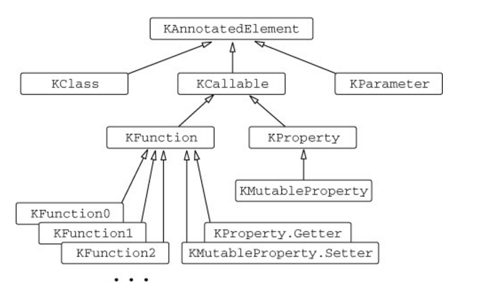

# Reflection

리플렉션은 실행 시점에 동적으로 객체의 프로퍼티와 메서드에 접근할 수 있게 해주는 방법이다.&#x20;

보통은 소스 코드 안에 구체적인 선언이 있는 메서드나 프로퍼티 이름을 단서로, 컴파일러가 찾아 실제 존재함을 보장한다. 하지만 타입과 관계 없이 객체를 다뤄야 하거나 단서가 오직 실행 시점에만 알 수 있는 경우가 있다.&#x20;

리플렉션을 사용하면 실행 시점에 알 수 있는 것도 접근할 수 있다.&#x20;

코틀린에서의 리플렉션은 두 가지 서로 다른 리플렉션 API를 다뤄야 한다.

첫 째는 자바가 java.lang.reflect 패키지를 통해 제공하는 표준 리플렉션이다. 코틀린 클래스는 일반 자바 바이트코드로 컴파일되므로 코틀린 코드와 완전히 호환된다.

둘 째 API는 코틀린이 kotlin.reflect 패키지를 통해 제공하는 API이다. 이 API는 자바에는 없는 프로퍼티나 널이 될 수 있는 타입과 같은 코틀린 개념에 대한 리플렉션을 제공한다. 하지만 자바 리플렉션의 복잡한 기능을 완전히 대체하지는 않고 있다. 그렇지만 이 API를 통해 다른 JVM 언어에서 생성한 바이트코드도 충분히 다룰 수 있다.&#x20;


## 코틀린 리플렉션 API

### KClass&#x20;

java.lang.Class에 해당하는 Kclass를 사용하면 클래스 안에 있는 모든 선언을 열거하고 각 선언에 접근하거나 클래스의 상위 클래스를 얻는 등의 작업이 가능하다. 실행 시점에 객체의 클래스를 얻으려면 먼저 객체의 자바 클래스를 얻어야 한다. 자바 클래스를 얻었으면 .kotlin 확장 프로퍼티를 통해 자바에서 코틀린 리플렉션 API로 옮겨올 수 있다.&#x20;

```kotlin
data class Person(val name:String, val age: Int)

import kotlin.reflect.full.*

val person = Person("John", 30)
val kClass = person.javaClass.kotlin
println(kClass.simpleName) // Person
kClass.memberProperties.forEach { 
    println(it.name) // age, name
}

    
```

<details>

<summary>KClass 정의</summary>

```kotlin
public actual interface KClass<T : Any> : KDeclarationContainer, KAnnotatedElement, KClassifier {
    /**
     * The simple name of the class as it was declared in the source code,
     * or `null` if the class has no name (if, for example, it is a class of an anonymous object).
     */
    public actual val simpleName: String?

    /**
     * The fully qualified dot-separated name of the class,
     * or `null` if the class is local or a class of an anonymous object.
     */
    public actual val qualifiedName: String?

    /**
     * All functions and properties accessible in this class, including those declared in this class
     * and all of its superclasses. Does not include constructors.
     */
    override val members: Collection<KCallable<*>>

    /**
     * All constructors declared in this class.
     */
    public val constructors: Collection<KFunction<T>>

    /**
     * All classes declared inside this class. This includes both inner and static nested classes.
     */
    public val nestedClasses: Collection<KClass<*>>

    /**
     * The instance of the object declaration, or `null` if this class is not an object declaration.
     */
    public val objectInstance: T?

    /**
     * Returns `true` if [value] is an instance of this class on a given platform.
     */
    @SinceKotlin("1.1")
    public actual fun isInstance(value: Any?): Boolean

    /**
     * The list of type parameters of this class. This list does *not* include type parameters of outer classes.
     */
    @SinceKotlin("1.1")
    public val typeParameters: List<KTypeParameter>

    /**
     * The list of immediate supertypes of this class, in the order they are listed in the source code.
     */
    @SinceKotlin("1.1")
    public val supertypes: List<KType>

    /**
     * The list of the immediate subclasses if this class is a sealed class, or an empty list otherwise.
     */
    @SinceKotlin("1.3")
    public val sealedSubclasses: List<KClass<out T>>

    /**
     * Visibility of this class, or `null` if its visibility cannot be represented in Kotlin.
     */
    @SinceKotlin("1.1")
    public val visibility: KVisibility?

    /**
     * `true` if this class is `final`.
     */
    @SinceKotlin("1.1")
    public val isFinal: Boolean

    /**
     * `true` if this class is `open`.
     */
    @SinceKotlin("1.1")
    public val isOpen: Boolean

    /**
     * `true` if this class is `abstract`.
     */
    @SinceKotlin("1.1")
    public val isAbstract: Boolean

    /**
     * `true` if this class is `sealed`.
     * See the [Kotlin language documentation](https://kotlinlang.org/docs/reference/sealed-classes.html)
     * for more information.
     */
    @SinceKotlin("1.1")
    public val isSealed: Boolean

    /**
     * `true` if this class is a data class.
     * See the [Kotlin language documentation](https://kotlinlang.org/docs/reference/data-classes.html)
     * for more information.
     */
    @SinceKotlin("1.1")
    public val isData: Boolean

    /**
     * `true` if this class is an inner class.
     * See the [Kotlin language documentation](https://kotlinlang.org/docs/reference/nested-classes.html#inner-classes)
     * for more information.
     */
    @SinceKotlin("1.1")
    public val isInner: Boolean

    /**
     * `true` if this class is a companion object.
     * See the [Kotlin language documentation](https://kotlinlang.org/docs/reference/object-declarations.html#companion-objects)
     * for more information.
     */
    @SinceKotlin("1.1")
    public val isCompanion: Boolean

    /**
     * `true` if this class is a Kotlin functional interface.
     */
    @SinceKotlin("1.4")
    public val isFun: Boolean

    /**
     * `true` if this class is a value class.
     */
    @SinceKotlin("1.5")
    public val isValue: Boolean

    /**
     * Returns `true` if this [KClass] instance represents the same Kotlin class as the class represented by [other].
     * On JVM this means that all of the following conditions are satisfied:
     *
     * 1. [other] has the same (fully qualified) Kotlin class name as this instance.
     * 2. [other]'s backing [Class] object is loaded with the same class loader as the [Class] object of this instance.
     * 3. If the classes represent [Array], then [Class] objects of their element types are equal.
     *
     * For example, on JVM, [KClass] instances for a primitive type (`int`) and the corresponding wrapper type (`java.lang.Integer`)
     * are considered equal, because they have the same fully qualified name "kotlin.Int".
     */
    override fun equals(other: Any?): Boolean

    override fun hashCode(): Int
}
```

</details>


### KCallable

KClass의 정의를 보면 클래스의 모든 멤버의 목록이 KCallable 인스터스의 컬렉션이다. KCallable은 함수와 프로퍼티를 아우르는 공통 상위 인터페이스다. 그 안에는 call 메서드가 있으며, 사용하면 함수나 프로퍼티의 게터를 호출 할 수 있다. KCallable interface와 그 예를 보자.

```kotlin
interface KCallable<out R>{
    fun call(vararg args:Any?): R 
}
fun foo(x: Int) = println(x)
val kFunction: KFunction1<Int, Unit> = ::foo 
kFunction.call(42) //42
```

::foo를 통해 함수를 값으로 나타는데 이 타입이 리플렉션 API에 있는 KFunction 클래스의 인스턴스이다.&#x20;

이 함수 참조가 가리키는 함수를 호출하려면 call 메서드를 호출한다. 하지만 foo 함수처럼 인자 한개만 받는 구체적인 메서드를 사용하려면 invoke 메서드를 사용하면 된다.&#x20;


### KProperty

멤버 프로퍼티는 KProperty1 인스턴스로 표현된다. 그 안에는 인자가 1개인 get 메서드가 들어있다.  멤버 프로퍼티는 어떤 객체에 속해 있는 프로퍼티이므로 get 메서드에게 프로퍼티를 얻고자 하는 객체를 넘겨줘야 한다.&#x20;

```kotlin
  val person = Person("John", 42)
  val memberProperty = Person::age
  println(memberProperty.get(person))
```

Kproperty는 제네릭 클래스이다. 위의 memberProperty 변수는 KProperty\<Person, Int>타입으로, 첫 번째 타입 파라미터는 수신 객체 타입, 두번 째 타입 파라미터는 프로퍼티 타입을 표현한다.&#x20;

최상위 수준이나 클래스 안에 정의된 프로퍼티만 리플렉션으로 접근할 수 있고 함수의 로컬 변수에는 접근할 수 없다.&#x20;


### 코틀린 리플렉션 API 인터페이스 계층 구조

<figure><figcaption><p>reflection api interface </p></figcaption></figure>


## 리플렉션을 사용한 객체 직렬화 구현&#x20;

제이키드의 직렬화 함수 선언을 보자.  `fun serialize(obj: Any): String`

객체를 받아서 json 형식의 문자열을 돌려줄 것이다. 이 함수는 객체의 프로퍼티와 값을 직렬화하면서 StringBuilder 객체 뒤에 문자열을 추가할 것이다. append 호출을 더 간결하게 하기 위해 직렬화 기능을 StringBuilder의 확장함수로 구현하자. 이렇게 하면 별도의 StringBuilder 객체를 지정하지 않아도 편하게 append를 사용할 수 있을 것이다.&#x20;

```kotlin
// 함수 파라미터를 확장 함수의 수신 객체로 바꾸고 있다.
private fun StringBuilder.serializeObject(x:Any){...}
```

serializeObject는 지금 설명하는 맥락을 벗어나면 아무 쓸모가 없기 때문에 private 가시성을 지정한다. 이 함수를 확장함수를 만든 이유는 이 코드블록에서 주로 사용하는 객체가 어떤 것인지 보여주고 그 객체를 더 쉽게 다루기 위함이다.&#x20;

`fun serialize(obj:Any): String = buildString {serializeObject(obj)}`

buildString은 StringBuilder를 생성하고 인자로 받은 람다에게 넘기며 toString 작업도 해준다. 람다에서는 StringBuilder인스턴스를 this로 사용할 수 있으므로 확장 함수 serializeObject 함수를 바로 사용하고 있다.&#x20;

이제 직렬화 함수 본문을 채워보자.&#x20;

```kotlin
private fun StringBuilder.serializeObject(obj:Any){
    val kClass = obj::class // 객체의 KClass를 얻는다. 
    val properties = kClass.memberProperties // 클래스의 모든 프로퍼티를 얻는다. 
    properties.joinToStringBuilder(this, prefix = "{", postfix = "}") { prop ->
        serializeString(prop.name) // 프로퍼티의 이름을 얻는다. 
        append(":")
        serialziePropertyValue(prop.get(obj)) // 프로퍼티 값을 얻는다. 
    }
}
```

* joinToStringBuilder는 프로퍼티를 콤마로 분리해준다.&#x20;
* serializeString는 JSON명세에 따라 특수 문자를 이스케이프 해준다.&#x20;
* serialziePropertyValue는 값의 타입에 따라 적절히 직렬화한다. KProperty 인스턴스 값을 얻는 방법인 get 메서드를 보면 어떤 객체의 클래스에 정의된 모든 프로퍼티를 열거하기 때문에 정확히 각 프로퍼티가 어떤 타입인지 알 수 없다. 따라서 props 변수 타입은 KProperty\<Any, \*>이며, prop.get(obj)메서드 호출은 Any 타입의 값을 반환한다.&#x20;


### 애노테이션을 활용한 직렬화 제어&#x20;

앞서 직렬화 과정을 제어하는 애노테이션 정의를 살펴봤다. 이제 이 애노테이션을 seralizeObject 함수가 어떻게 처리하는지 살펴보자.&#x20;

### @JsonExclude

KAnnotatedElement 인터페이스에는 annotations 프로퍼티가 있다. 이는 해당 요소에 적용된 모든 애노테이션 인스턴스의 컬렉션이다. Kproperty는 KAnnotatedElement를 확장하기 때문에 프로퍼티의 모든 애너테이션을 얻을 수 있다. 우리는 @JsonExclude만 찾으면 되기 때문에 findAnnotation함수를 사용하면 적절하고, 이를 filter를 통해 @JsonExclude가 적용된 프로퍼티만 걸러낼 수 있다.&#x20;

```kotlin
val properties = kClass.memberProperties.filter {it.findAnnotation<JsonExclude>() == null}
```

### @JsonName&#x20;

```kotlin
val jsonNameAnn = prop.findAnnotation<JsonName>()
val propsName = jasonNameAnn?.name ?: props.name // 애노테이션에서 name이 없다면 prop.name
```

만약 JsonName이 적용된 프로퍼티라면 "alias"가 키가 될 것이고 없다면 프로퍼티 이름이 키 이름이 될 것이다.


이제 동작들을 직렬화 로직에 반영해보자. 아래코드는 JsonExclude가 적용된 프로퍼티를 제거해준다.

```kotlin
private fun StringBuilder.serializeObject(obj: Any) {
    obj.javaClass.kotlin.memberProperties
        .filter { it.findAnnotation<JsonExclude>() == null }
        .joinToStringBuilder(this, prefix = "{", postfix = "}") {
            serializeProperty(it, obj)
        }
}
```

아래 코드는 serializeProperty 확장 함수로 정의한다. 이 함수는 @JsonName에 따라 프로퍼티 이름을 처리한다.

```kotlin
private fun StringBuilder.serializeProperty(prop: KProperty1<Any, *>, obj: Any) {
    val jsonNameAnn = prop.findAnnotation<JsonName>()
    val propName = jsonNameAnn?.name ?: prop.name
    serializeString(propName)
    append(": ")
    serializePropertyValue(prop.get(obj))
} 
```

이제 @CustomSerializer를 구현해보자.  이 구현은 getSerializer라는 함수에 기초한다. 이 함수를 통해 등록된 ValueSerializer 인스턴스를 얻을 것이다.&#x20;

```kotlin
fun KProperty<*>.getSerializer(): ValueSerailizer<Any?>?{
    val customSerializerAnn = findAnnotation<CustomSerializer>() ?: return null
    val serializerClass = customSerializerAnn.serializerClass
    val valueSerializer = serializerClass.objectInstance ?: serializerClass.createInstance()
    @Suppress("UNCHECKED_CAST")
    return valueSerializer as ValueSerailizer<Any?>

```

KProperty를 주로 다루기 때문에 Kproperty의 확장함수로 메서드를 정의했다.&#x20;

CustomSerializer를 찾고 그 애노테이션의 값 serializerClass가 직렬화 될 클래스이다. 그 후 이 클래스가 object로 선언된 싱글턴이라면 objectInstance에 들어 있다. 따라서 object면 바로 사용하기 그게 아니라면 인스턴스화해서 객체를 생성한다.&#x20;

다음은 최종 serializeProperty이다.&#x20;

```kotlin
fun StringBuilder.serializeProperty(prop: KProperty1<Any, *>, obj:Any) {
    val name = prop.findAnnotation<JsonName>()?.name ?: prop.name
    serializeString(name)
    append(": ")
    val value = prop.get(obj)
    val jsonValue = prop.getSerializer()?.toJsonValue(value) ?: value
    serializePropertyValue(jsonValue)
}
```

<details>

<summary>최종 Serializer </summary>

```kotlin
fun serialize(obj: Any): String = buildString { serializeObject(obj) }

/* the first implementation discussed in the book */
private fun StringBuilder.serializeObjectWithoutAnnotation(obj: Any) {
    val kClass = obj.javaClass.kotlin
    val properties = kClass.memberProperties

    properties.joinToStringBuilder(this, prefix = "{", postfix = "}") { prop ->
        serializeString(prop.name)
        append(": ")
        serializePropertyValue(prop.get(obj))
    }
}

private fun StringBuilder.serializeObject(obj: Any) {
    obj.javaClass.kotlin.memberProperties
            .filter { it.findAnnotation<JsonExclude>() == null }
            .joinToStringBuilder(this, prefix = "{", postfix = "}") {
                serializeProperty(it, obj)
            }
}

private fun StringBuilder.serializeProperty(
        prop: KProperty1<Any, *>, obj: Any
) {
    val jsonNameAnn = prop.findAnnotation<JsonName>()
    val propName = jsonNameAnn?.name ?: prop.name
    serializeString(propName)
    append(": ")

    val value = prop.get(obj)
    val jsonValue = prop.getSerializer()?.toJsonValue(value) ?: value
    serializePropertyValue(jsonValue)
}

fun KProperty<*>.getSerializer(): ValueSerializer<Any?>? {
    val customSerializerAnn = findAnnotation<CustomSerializer>() ?: return null
    val serializerClass = customSerializerAnn.serializerClass

    val valueSerializer = serializerClass.objectInstance
            ?: serializerClass.createInstance()
    @Suppress("UNCHECKED_CAST")
    return valueSerializer as ValueSerializer<Any?>
}

private fun StringBuilder.serializePropertyValue(value: Any?) {
    when (value) {
        null -> append("null")
        is String -> serializeString(value)
        is Number, is Boolean -> append(value.toString())
        is List<*> -> serializeList(value)
        else -> serializeObject(value)
    }
}

private fun StringBuilder.serializeList(data: List<Any?>) {
    data.joinToStringBuilder(this, prefix = "[", postfix = "]") {
        serializePropertyValue(it)
    }
}

private fun StringBuilder.serializeString(s: String) {
    append('\"')
    s.forEach { append(it.escape()) }
    append('\"')
}

private fun Char.escape(): Any =
        when (this) {
            '\\' -> "\\\\"
            '\"' -> "\\\""
            '\b' -> "\\b"
            '\u000C' -> "\\f"
            '\n' -> "\\n"
            '\r' -> "\\r"
            '\t' -> "\\t"
            else -> this
        }
```

</details>


## 역직렬화&#x20;

역직렬화 API는 아래 함수로 이루어져 있다.

```kotlin
inline fun <reified T: Any> deserialize(json:String): T
```

역직렬화는 3단계로 구현돼 있는데, 첫 단계는 어휘 분석기(렉서) 두 번째는 문법 분석기(파서) 나머지는 파싱한 결과를 바탕으로 객체를 생성하는 역직렬화 컴퍼넌트이다.&#x20;

어휘 분석기는 문자열을 토큰의 리스트로 변환한다. 토큰은 2가지 종류가 있는데, 문자 토큰(json 문법 , :)과 값 토큰이다. 파서는 토큰의 리스트를 구조화된 표현으로 변환한다. 토큰을 키/ 값 쌍과 배열로 표현할 것이다.

JsonObject 인터페이스는 현재 역직렬화 중인 객체나 배열을 추적한다. 파서는 객체의 새로운 프로퍼티를 발견할 때마다 그 프로퍼티의 유형(간단한 값, 복합 , 배열)에 해당하는 JsonObject의 함수를 호출한다.&#x20;

```kotlin
interface JsonObject {
    fun setSimpleProperty(propertyName: String, value: Any?) // 바로 값 등록 

    fun createObject(propertyName: String): JsonObject // 값이 객체면 object jsonobject생성 

    fun createArray(propertyName: String): JsonObject
}
```

그 후 역직렬화 컴퍼넌트는 각 JsonObject에 상응하는 코틀린 타입의 인스턴스를 점차 만들어내는 JsonObject 구현을 제공한다.&#x20;

Seed 인터페이스는 빌더처럼 여러 프로퍼티의 유형을 Object로 변환하고 spwan이라는 최종 build하는 메서드를 가지고 있다.&#x20;


기본 Seed 인터페이스는 JsonObject를 확장하면서 객체 생성 과정이 끝난 후 결과 인스턴스를 얻기 위한 spwn 메서드를 추가 제공한다.  또한 중첩된 객체나 중첩된 리스트를 만들 때 사용할 createCompositeProperty도 들어 있다.&#x20;

```kotlin
interface Seed: JsonObject {
    val classInfoCache: ClassInfoCache

    fun spawn(): Any?

    fun createCompositeProperty(propertyName: String, isList: Boolean): JsonObject

    override fun createObject(propertyName: String) = createCompositeProperty(propertyName, false)

    override fun createArray(propertyName: String) = createCompositeProperty(propertyName, true)
}
```


```kotlin
fun <T: Any> deserialize(json:Reader, targetClass:KClass<T>): T{
    val seed = ObjectSeed(targetClass,ClassInfoCache()) // 직렬화할 객체의 프로퍼티를 담을 객체
    Parser(json,seed).parse() // 파서를 호출해 object로 변환
    return seed.spawn() // 결과 객체 생성 
}
```

ObjectSeed 구현을 살펴보자. ObjectSeed는 지금 만들고 있는 객체와 결과 클래스 안의 프로퍼티에 대한 정보를 저장하는 캐시인 classInfoCache 객체를 인자로 받는다.

```kotlin
class ObjectSeed<out T: Any>(
        targetClass: KClass<T>,
        override val classInfoCache: ClassInfoCache
) : Seed {
    // targetClass의 인스턴스를 만들 때 필요한 정보를 캐시한다.
    private val classInfo: ClassInfo<T> = classInfoCache[targetClass]

    private val valueArguments = mutableMapOf<KParameter, Any?>()
    private val seedArguments = mutableMapOf<KParameter, Seed>()

    private val arguments: Map<KParameter, Any?>
        get() = valueArguments + seedArguments.mapValues { it.value.spawn() }

    override fun setSimpleProperty(propertyName: String, value: Any?) {
        val param = classInfo.getConstructorParameter(propertyName)
        valueArguments[param] = classInfo.deserializeConstructorArgument(param, value)
    }

    override fun createCompositeProperty(propertyName: String, isList: Boolean): Seed {
        val param = classInfo.getConstructorParameter(propertyName)
        val deserializeAs = classInfo.getDeserializeClass(propertyName)
        val seed = createSeedForType(
                deserializeAs ?: param.type.javaType, isList)
        return seed.apply { seedArguments[param] = this }
    }

    override fun spawn(): T = classInfo.createInstance(arguments)
}
```

ObjectSeed는 생성자 파라미터와 값을 연결해주는 맵을 만든다. valueArguments는 간단한 값 프로퍼티를 저장하고, seedArgumnets는 복합 프로퍼티를 저장한다. 초기 상태에서 새로운 복합 시드를 추가한 후 입력 스트림에서 들어오는 데이터로 그 복합 시드에 데이털르 채워 놓는다. 마지막으로 spwn 메서드는 내부에 중첩된 모든 시드의 spwn을 재귀적으로 호출해 내부 객체 계층 구조를 만든다.&#x20;

최종 결과인 객체 인스턴스를 생성하고 생성자 파라미터 정보를 캐시하는 ClassInfo는 ObjectSeed 안에서 쓰인다.  그 전에 Cache를 알아보자.

ClassInfoCache는 리플렉션 연산의 비용을 줄이기 위한 클래스이다. 객체를 역직렬화 할 때는 프로퍼티가 아니라 생성자 파라미터를 다뤄야 한다. JSON에서 모든 키 깞 쌍을 읽을 때마다 검색하면 느려지기 때문에 클래스별로 한 번만 검색을 수행하고 결과를 캐시에 놓아둔다.&#x20;

```kotlin
class ClassInfoCache {
    private val cacheData = mutableMapOf<KClass<*>, ClassInfo<*>>()

    @Suppress("UNCHECKED_CAST")
    operator fun <T : Any> get(cls: KClass<T>): ClassInfo<T> =
            cacheData.getOrPut(cls) { ClassInfo(cls) } as ClassInfo<T>
}
```

ClassInfo 클래스는 대상 클래스의 새 인스턴스를 만들고 필요한 정보를 캐시해 둔다.&#x20;

```kotlin
class ClassInfo<T : Any>(cls: KClass<T>) {
    private val className = cls.qualifiedName
    private val constructor = cls.primaryConstructor
            ?: throw JKidException("Class ${cls.qualifiedName} doesn't have a primary constructor")

    private val jsonNameToParamMap = hashMapOf<String, KParameter>()
    private val paramToSerializerMap = hashMapOf<KParameter, ValueSerializer<out Any?>>()
    private val jsonNameToDeserializeClassMap = hashMapOf<String, Class<out Any>?>()

    init {
        constructor.parameters.forEach { cacheDataForParameter(cls, it) }
    }

    private fun cacheDataForParameter(cls: KClass<*>, param: KParameter) {
        val paramName = param.name
                ?: throw JKidException("Class $className has constructor parameter without name")

        val property = cls.declaredMemberProperties.find { it.name == paramName } ?: return
        val name = property.findAnnotation<JsonName>()?.name ?: paramName
        jsonNameToParamMap[name] = param

        val deserializeClass = property.findAnnotation<DeserializeInterface>()?.targetClass?.java
        jsonNameToDeserializeClassMap[name] = deserializeClass

        val valueSerializer = property.getSerializer()
                ?: serializerForType(param.type.javaType)
                ?: return
        paramToSerializerMap[param] = valueSerializer
    }


    fun createInstance(arguments: Map<KParameter, Any?>): T {
        ensureAllParametersPresent(arguments)
        return constructor.callBy(arguments)
    }

    private fun ensureAllParametersPresent(arguments: Map<KParameter, Any?>) {
        for (param in constructor.parameters) {
            if (arguments[param] == null && !param.isOptional && !param.type.isMarkedNullable) {
                throw JKidException("Missing value for parameter ${param.name}")
            }
        }
    }
}
```

초기화 시 이 코드는 각 생성자 파라미터에 해당하는 프로퍼티를 찾아서 애노테이션을 가져온다. ClassInfo는 프로퍼티 이름으로 생성자 파라미터를 제공할 수 있다.&#x20;

* jsonNameToParam map: json 파일의 각 키
* paramToSerializer 맵 : 각 파라미터에 대한 직렬화기&#x20;
* jasonNameToDeserializerClass는 @DeserializeInterface 애노테이션 인자로 지정한 클래스를 저장

callBy 메서드를 사용하면 메서드를 호출하면서 디폴트 파라미터 값을 사용한다.

```kotlin
  fun createInstance(arguments: Map<KParameter, Any?>): T {
        ensureAllParametersPresent(arguments) //모든 파라미터가 존재하는 지 체크
        return constructor.callBy(arguments) // 생성자를 호출해 객체 생성 
   }
```

## 정리&#x20;

애노테이션에서 인자로 전달한 값을 리플렉션 API를 통해 실제 실행시점에서도 접근할 수 있어 필요한 로직을 처리할 수 있다.&#x20;

