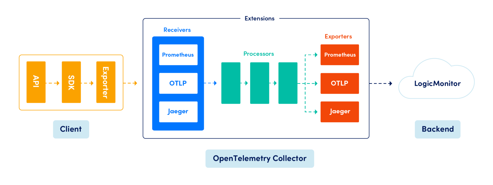

# OpenTelemetry

## OpenTelemetry란?

Opentelemetry는 MSA 처럼 복잡하게 분산된 환경으로 인해 중요해진 Traces, Metrics, Logs 처럼 관찰 가능성을 위해 만들어진 [CNCF](https://www.cncf.io/) 재단의 오픈소스 프로젝트이다.

OpenTelemtry는 기존의 모니터링과 다르게 데이터를 수집하고 전처리하는 책임만 가지고 실제 데이터를 저장하거나 표현은 다른 벤더에게 위임한다.

이런 중간에서 인터페이스 역할 덕에 우리는 다양한 모니터링 서비스를 사이드 이펙트 없이 교체하고 사용할 수 있다.

아래 샘플코드([git 저장소](https://github.com/spandios/opentelemetry-example))를 통해 어떻게 opentelemetry를 적용했는지 살펴보자.


### OtelCollector&#x20;

먼저 핵심인 Collector를 알아보자. Collector는 소스(클라이언트)로부터 데이터를 수집 후&#x20;

Collector는 크게 Receivers, Proceecors, Exporters로 역할을 분리하고 있다.

<figure><figcaption><p>Collector</p></figcaption></figure>

#### Receivers

소스로부터 특정한 포맷으로 데이터를 받는 곳으로 내부 콜렉터가 이해할 수 있는 데이터 포맷으로 변환하고 다음 단계로 전달한다.

#### Processors <a href="#h-processors" id="h-processors"></a>

Exporters로 데이터가 가기 전 추가적인 처리를 하는 곳이다. 데이터에 추가적인 작업을 하거나 배치같은 처리를 할 수 잇다.

#### Exporters <a href="#h-exporters" id="h-exporters"></a>

실제 데이터를 어디에 전달할지 정의하는 곳이다.&#x20;


docker-compose.yml를 작성하자

```yaml
version: "3"
services:

  otel-collector:
    container_name: otel-collector
    image: otel/opentelemetry-collector:latest
    command: [ "--config=/etc/otel-collector-config.yaml" ]
    volumes:
      - ./otel-collector-config.yaml:/etc/otel-collector-config.yaml


```

otel-collector-config.yaml를 작성한다.

```yaml
receivers:
  otlp:
    protocols:
      grpc:
processors:
  batch:
exporters:
  prometheus:
    endpoint: "0.0.0.0:9090" # prometheus endpoint
  logging:
  jaeger:
    endpoint: "jaeger:14250" # jager endpoint
    tls:
      insecure: true


service:
  pipelines:
    traces:
      receivers: [ otlp ] # otlp로 받고 
      processors: [ batch ] # 배치로 전처리하면서 
      exporters: [ logging, jaeger ] # jaeger로 traces 정보 전달
    metrics:
      receivers: [ otlp ]
      exporters: [ logging, prometheus ]  # prometheus로 메트릭 정보 전달
    logs:
      receivers: [ otlp ]
      exporters: [ logging ] 

```


### 나머지 docker-compose.yml를 추가한다.&#x20;

### Jaeger, Prometheus, Grafana

```yaml
# 예거는 분산환경에서 트레이싱할 수 있는 오픈소스 프로젝트이다. 고로 만들어졌는지 고 케릭터가 있다. 
  jaeger: 
  image: jaegertracing/all-in-one:latest
  container_name: jaeger
  ports:
    - "16686:16686" # 웹 UI에 접속하기 위해

  prometheus:
    image: prom/prometheus:latest
    container_name: prometheus
    volumes:
      - ./prometheus-config.yml:/etc/prometheus/prometheus.yml
    ports:
      - "9090:9090"

  grafana:
    image: grafana/grafana:latest
    container_name: grafana
    ports:
      - "3000:3000"
      
```

prometheus-config.yml

```yaml
# prometheus가 주기적으로 metric 정보를 직접 app에서 가져온다.
global:
  scrape_interval: 15s
  scrape_timeout: 10s
  evaluation_interval: 15s
scrape_configs:
  - job_name: app
    honor_timestamps: true
    scrape_interval: 15s
    scrape_timeout: 10s
    metrics_path: /actuator/prometheus # spring boot actuator + prometheus
    scheme: http
    static_configs:
      - targets:
          - application:8080
```


### Application

다음은 spring application 설정이다.

```yaml
  application:
    build:
      context: .
    environment:
      OTEL_SERVICE_NAME: opentelemetry-example # service name 
      OTEL_EXPORTER_OTLP_ENDPOINT: http://otel-collector:4317 # otlp collector 주소 설정
    ports:
      - "8080:8080"
    restart: always
    depends_on:
      - otel-collector
```


### Jaeger

이제 `curl localhost:8080를` 호출한 뒤 [http://localhost:16686/](http://localhost:16686/)속하면 trace를 볼 수 있다.&#x20;

<figure><figcaption></figcaption></figure>

