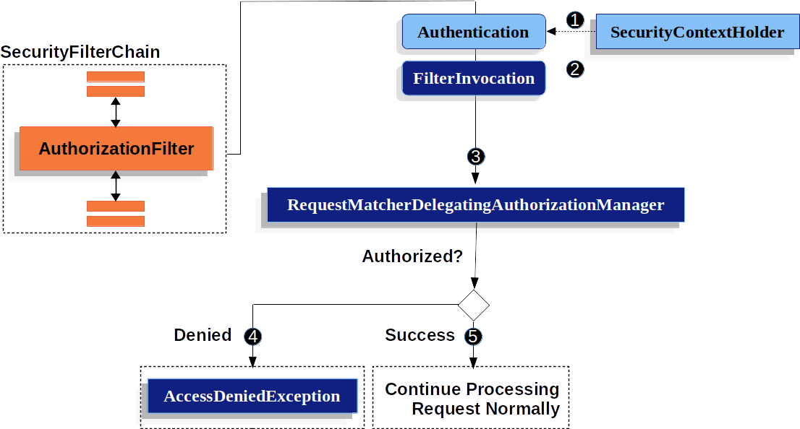

# 인가

HttpServlet을 통한 인가방식을 예시로 인가를 어떻게 처리하는지 알아도록 하자.


스프링 시큐리티에서 인가는 GrantedAuthority 객체를 통해 수행한다.&#x20;

GrantedAuthority 객체는 AuthenticationManager에 의해 authentication token 에 삽입된다.

나중에 권한 부여 결정을 내릴 때 AuthorizationManager에서 GrantedAuthority객체를 가져오고 판단한다.


### AuthorizationManager

AuthorizationManager는 AccessDecisionManager와 AccessDecisionVoter 모두 대체한다.&#x20;

AuthorizationManager는 AuthorizationFilter로부터 호출되며 최종적으로 접근권한 결정에 역할을 가진다.&#x20;

AuthorizationManager interface는  두 가지 메서드를 보유한다.

```
public interface AuthorizationManager<T> {

	default void verify(Supplier<Authentication> authentication, T object) {
		AuthorizationDecision decision = check(authentication, object);
		if (decision != null && !decision.isGranted()) {
			throw new AccessDeniedException("Access Denied");
		}
	}

	@Nullable
	AuthorizationDecision check(Supplier<Authentication> authentication, T object);

}
```


### 인가 흐름




AuthorizationFilter 또한 SecurityFilterChian에 등록되어 있다.

1. AuthorizationFilter는 SecurityContextHolder에 있는 Authentication을 얻는다.

```kotlin
@Override
	protected void doFilterInternal(HttpServletRequest request, HttpServletResponse response, FilterChain filterChain)
			throws ServletException, IOException {

		AuthorizationDecision decision = this.authorizationManager.check(this::getAuthentication, request);
		this.eventPublisher.publishAuthorizationEvent(this::getAuthentication, request, decision);
		if (decision != null && !decision.isGranted()) {
			throw new AccessDeniedException("Access Denied");
		}
		filterChain.doFilter(request, response);
	}

	private Authentication getAuthentication() {
		Authentication authentication = SecurityContextHolder.getContext().getAuthentication();
		if (authentication == null) {
			throw new AuthenticationCredentialsNotFoundException(
					"An Authentication object was not found in the SecurityContext");
		}
		return authentication;
	}
```


&#x20;2\. Filter는 FilterInvocation을 생성한다. 이 객체는 request와 response가 HttpServletRequest와 HttpServletResponse의 객체인 것을 보장한다.

3\. 이 후 AuthorizationManaegr를 구현한 RequestMathcerDelegatingAuthorizationManager가 check함수를 통해 Authorized된 것인지 체크 하게 된다.&#x20;

4\. 만약 권한이 없다면 AccessDeniedException이 발생하고&#x20;

5\. 만약 접근에 권한이 있다면 AuthorizaionFilter는 계속 문제 없이 진행될 것이다.

아래는 실제 권한을 설정하는 예시이다.

```kotlin
    @Bean
    @Order(1)
    @Throws(java.lang.Exception::class)
    fun apiFilterChain(http: HttpSecurity): SecurityFilterChain {
       

        http.
            .authorizeRequests()
            .antMatchers(
                SecurityConstants.STATUS_URL_MAPPING,
                SecurityConstants.API_V1_AUTH_URL_MAPPING,
                SecurityConstants.ACTUATOR_URL_MAPPING,
                SecurityConstants.REST_DOCS_URL_MAPPING,
                SecurityConstants.VERSION_URL_MAPPING,
            ).permitAll()
            .antMatchers(SecurityConstants.VERSION_URL_MAPPING).hasRole("ADMIN")
            .anyRequest().authenticated()
       

        return http.build()
    }
```


참고

[https://docs.spring.io/spring-security/reference/servlet/authorization/index.html](https://docs.spring.io/spring-security/reference/servlet/authorization/index.html)

