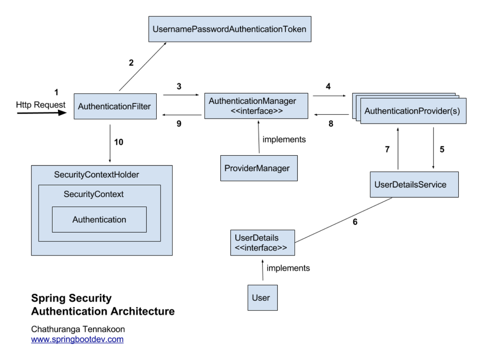

# 인증

스프링 시큐리티에서 인증 아키텍쳐와 JWT 방식으로 구현했을 때를 예시로 흐름을 알아본다.



위의 그림을 참고해 시큐리티 인증의 흐름을 순서대로 살펴보겠습니다.

### 1. AuthenticationFilter&#x20;

클라이언트에서 요청이 오면 AuthenticationFilter를 먼저 거치게 됩니다.

OncePerRequestFilter를 구현하여 한번만 필터를 거치게 할 수 있습니다.


### 2. JwtAuthenticationToken

filter에서 인증을 위한 객체이자 후에 인증된 유저의 정보를 담고 있는 AuthenticationToken을 생성한다.&#x20;

```kotlin
class JwtAuthenticationToken : AbstractAuthenticationToken {
    var token: String = ""
    private var principal: Any? = null
    private var credentials = ""

    constructor(token: String) : super(null) {
        this.token = token
        this.isAuthenticated = false
    }

    constructor(principal: Any, authorities: Collection<GrantedAuthority>) : super(authorities) {
        this.principal = principal
        this.isAuthenticated = true
    }

    override fun getPrincipal(): Any? {
        return principal
    }

    override fun getCredentials(): Any {
        return credentials
    }
}

```


### 3. AuthenticationManager

방금 만든 AuthenticationToken을 Manager에게 넘겨 실제  인증처리를 한다.&#x20;


아래는 Filter에서  1 \~ 3 그리고 마지막 인증인 10까지를 보여준다.

```kotlin
// (1) Jwt를 위한 Filter
class JwtAuthTokenFilter(
    private val authenticationManager: AuthenticationManager
    private val jwtService: JwtService,

) : OncePerRequestFilter() {
    

    @Throws(ServletException::class, IOException::class)
    override fun doFilterInternal(
        @NonNull request: HttpServletRequest,
        @NonNull response: HttpServletResponse,
        @NonNull filterChain: FilterChain
    ) {
        
        val accessToken = jwtService.getJwtToken(request)

        if (!accessToken.isNullOrBlank()) {
            // (2) AuthenticationToken을 생성한다.
            val authentication = JwtAuthenticationToken(
                accessToken
            )

            try { 
                // (3) 인증시작
                val authentication = authenticationManager.authenticate(authenticationToken)
                
                // (10) 완료된 인증 token을 SecurityContextHlder에 저장함으로서 인증을 완료한다.
                SecurityContextHolder.getContext().authentication = authentication
            } catch (e: Exception) {
                SecurityUtils.clearAuthentication()
                request.setAttribute("ERROR", e)
            }
        }
        
        filterChain.doFilter(request, response)
    }
}

```


### 3.1 ProviderManager

AuthenticationManager의 구현은 ProviderManager가 하여 실제 인증을 진행한다.

provider manager는 authentication provider의 리스트를 보유하고 있다.

provider 리스트를 돌며 token과 호환되는 provider를 찾고 인증을 실행한다.

```kotlin
  Iterator var9 = this.getProviders().iterator();

        while(var9.hasNext()) {
            AuthenticationProvider provider = (AuthenticationProvider)var9.next();
            if (provider.supports(toTest)) {
                if (logger.isTraceEnabled()) {
                    Log var10000 = logger;
                    String var10002 = provider.getClass().getSimpleName();
                    ++currentPosition;
                    var10000.trace(LogMessage.format("Authenticating request with %s (%d/%d)", var10002, currentPosition, size));
                }

                try {
                    result = provider.authenticate(authentication);
```


### 4. AuthenticationProvider

진짜진짜 인증을 진행하는 JwtTokenProvider이다.&#x20;

jwt token에 저장된 아이디를 가져오고 실제 db에서 유저를 찾고 검증한다.&#x20;


```kotlin
@Component
class JwtTokenProvider(private val jwtService: JwtService, private val myUserDetailService: MyUserDetailService) :
    AuthenticationProvider {
   
    override fun authenticate(authentication: Authentication): Authentication {
        val id: String?
        val jwtAuthToken = authentication as JwtAuthenticationToken

        try {
            id = jwtService.getUsernameFromToken(jwtAuthToken.token)
        } catch (signatureException: SignatureException) {
            throw MyException(ErrorCode.INVALID_TOKEN, signatureException.message)
        } catch (expiredJwtException: ExpiredJwtException) {
            throw MyException(ErrorCode.EXPIRED_TOKEN, expiredJwtException.message)
        } catch (e: Exception) {
            throw MyException(ErrorCode.INVALID_TOKEN, e.message)
        }

        val userDetail = myUserDetailService.loadUserByUsername(id)

        return JwtAuthenticationToken(
            id,
            userDetail.authorities
        )
    }

    override fun supports(authentication: Class<*>): Boolean {
        return JwtAuthenticationToken::class.java.isAssignableFrom(authentication)
    }
}
```


### 5. UserDetailService

유저 아이디를 통해 DB로 부터 찾아 UserDetails를 리턴하는 loadUserByUsername을 구현하는 UserDetailService


### 10. SecurityContextHolder


* **SecurityContextHolder** : 인증이 완료된 유저의 정보를 담고 있음.
* **SecurityContext :** SecurityContextHolder에서 얻을 수 있으며, Authentication을 담고 있음.
* **Authentication :  현재 인증된 유저에 정보를 담고 있음 .**
  * Principal : user를 식별할 수 있는 데이터 (ex: id)
  * credentials : 비밀번호
  * authorities : 권한 목록



참고

[https://docs.spring.io/spring-security/reference/servlet/authentication/index.html](https://docs.spring.io/spring-security/reference/servlet/authentication/index.html)

[https://junhyunny.github.io/spring-boot/once-per-request-filter/](https://junhyunny.github.io/spring-boot/once-per-request-filter/)



